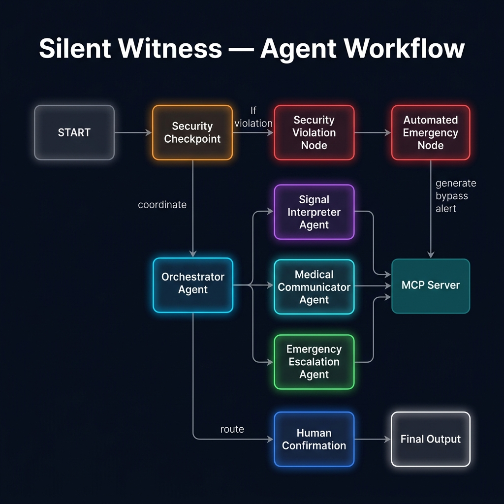
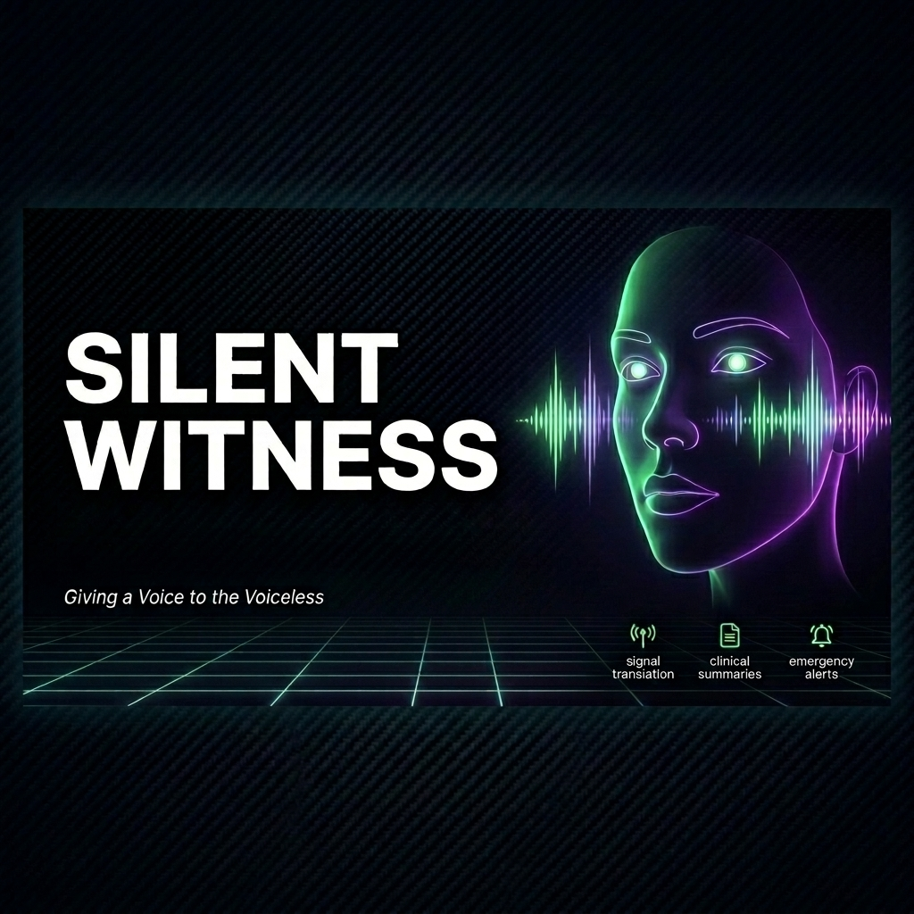
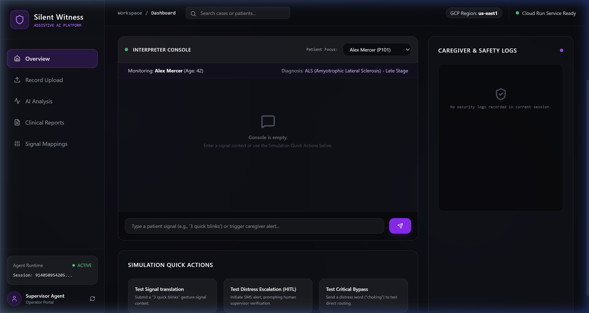
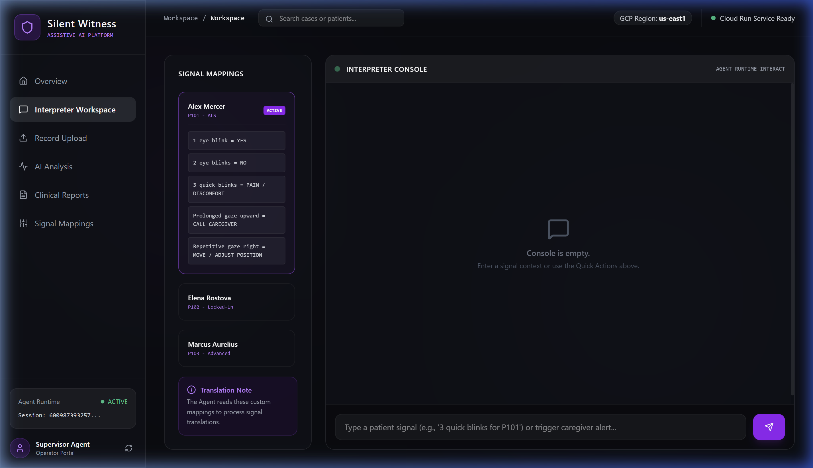
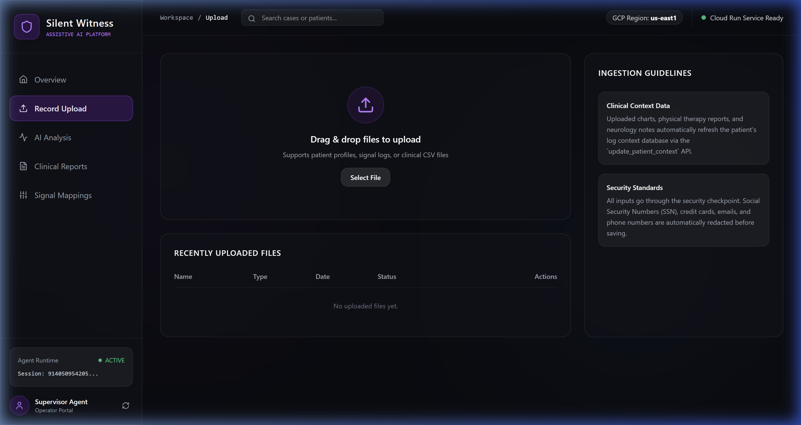

# Silent Witness Agent

> **Giving a voice to the voiceless** - An AI-powered assistive platform translating minimal physical signals, logging context memory, preparing clinical summaries, and escalating emergency events for people with severe communication disabilities (such as ALS or locked-in syndrome).
> 
> *(Note: Signal observation is manual-caregivers observe and input the gestures, e.g., "3 quick blinks"- and signal mappings are pre-established with the patient beforehand, not learned by the AI).*

**Live Demo:** [https://silent-witness-ui-j647da6ofa-ue.a.run.app](https://silent-witness-ui-j647da6ofa-ue.a.run.app)

---

## Prerequisites

- **Python 3.11** - Required for packaging compatibility with the Vertex AI Reasoning Engine runtime (newer versions like 3.13/3.14 are not supported by the backend).
- **uv** - [astral.sh/uv](https://docs.astral.sh/uv/getting-started/installation/)
- **Node.js 20+ & npm** - Required for compiling and running the caregiver React frontend.
- **Google Cloud SDK (gcloud CLI)** - Authenticated to your project, required for building and deploying to Google Cloud.
- **Gemini API key** - [aistudio.google.com/apikey](https://aistudio.google.com/apikey)

---

## Quick Start

```bash
git clone <repo-url>
cd silent-witness

cp .env.example .env       # add your GOOGLE_API_KEY
make install               # uv sync
make playground            # opens UI at http://localhost:18081
```

> ⚠️ **Windows users:** After any code edit, you must fully stop and restart the server. Hot-reload is disabled on Windows due to event-loop constraints.

---

## Architecture

```
                        ┌─────────────────────────────────────┐
                        │        Silent Witness Agent         │
                        │       (silent_witness_workflow)     │
                        └──────────────┬──────────────────────┘
                                       │
                              [User Input / START]
                                       │
                        ┌─────────────▼──────────────────┐
                        │      Security Checkpoint        │
                        │  • PII scrub (SSN/Email/Phone)  │
                        │  • Prompt injection detection   │
                        │  • Distress keyword detection   │
                        └──────┬─────────────────┬────────┘
                               │ safe             │ emergency / violation
                               ▼                  ▼
                     ┌──────────────────┐  ┌──────────────────┐
                     │   Orchestrator   │  │   Automated /    │
                     │      Agent       │  │  Violation Node  │
                     │  (delegates to   │  │ (alert & bypass) │
                     │   sub-agents)    │  └────────┬─────────┘
                     └──────┬───────────┘           │
                            │                       │
              ┌─────────────┼─────────────┐         │
              ▼             ▼             ▼         │
   ┌──────────────┐ ┌──────────────┐ ┌──────────────┐
   │    Signal    │ │   Medical    │ │  Emergency   │
   │ Interpreter  │ │ Communicator │ │  Escalation  │
   │  translates  │ │ doc summaries│ │ caregiver alert
   └──────┬───────┘ └──────┬───────┘ └──────┬───────┘
          └────────────────┴─────────────────┘
                           │ (all use MCP Toolset)
                           ▼
            ┌──────────────────────────────┐
            │        MCP Server            │
            │  • get_patient_profile       │
            │  • update_patient_context    │
            │  • generate_clinical_summary │
            │  • send_emergency_escalation │
            └──────────────────────────────┘
                           │
             [needs_confirmation?]
              ┌────────────┴─────────────┐
              ▼ yes                      ▼ no
   ┌─────────────────────┐    ┌──────────────────┐
   │  Human Confirmation │    │   Final Output   │
   │   (HITL Pause ✋)   │    │   (response)     │
   └─────────┬───────────┘    └──────────────────┘
             │ confirmed
             └──────► post_confirmation_node
```

---

## How to Run

| Command           | What it does                             |
|-------------------|------------------------------------------|
| `make install`    | Install all dependencies via `uv sync`   |
| `make playground` | Launch interactive UI at port 18081      |
| `make run`        | Start the Agent Runtime web server       |
| `make dashboard`  | Launch the React Caregiver Dashboard     |
| `make test`       | Run unit and integration tests           |

---

## Sample Test Cases

### Test Case 1 — Signal Translation

```
Input:    "Translate this for patient P101: 3 quick blinks"
Expected: signal_interpreter_agent → get_patient_profile(P101)
          → Explains that 3 quick blinks means PAIN / DISCOMFORT
Check:    Playground shows the translation details alongside caregiver contacts
```

### Test Case 2 — Clinical Summary Note

```
Input:    "Create a doctor summary for P101. Symptom details: stiffness in left arm, pain level 4."
Expected: medical_communicator_agent → generate_clinical_summary(...)
          → Returns a structured medical chart note
Check:    Playground displays a professional clinical summary date-stamped and signed
```

### Test Case 3 — Distress Escalation (with HITL)

```
Input:    "Trigger caregiver emergency alert for P101: patient shows rapid eye signal."
Expected: emergency_escalation_agent → send_emergency_escalation(...)
          → orchestrator calls request_human_confirmation
          → Workflow pauses at human_confirmation_node ✋
          → Operator types "yes" to confirm
          → Alert is sent and confirmation returned
Check:    Playground shows a confirmation prompt mid-flow, then the alert status
```

### Test Case 4 — Critical Bypass (Security Emergency Check)

```
Input:    "I am choking"
Expected: Security Checkpoint detects "choking"
          → Routes directly to automated_emergency_node (bypasses orchestrator)
          → Immediately alerts caregiver without needing LLM reasoning
Check:    Playground prints red 🚨 warning and automatically triggers caregiver SMS/Call alert
```

---

## Troubleshooting

| Error | Cause | Fix |
|-------|-------|-----|
| `429 RESOURCE_EXHAUSTED` | Gemini free tier quota hit | Set `GEMINI_MODEL=gemini-2.5-flash-lite` in `.env` for higher daily limits |
| `no agents found` | Wrong agent dir passed to `adk web` | Use `uv run adk web app --host 127.0.0.1 --port 18081` exactly |
| Server still shows old behavior after code edit | Windows hot-reload disabled | Kill the server with `Get-Process -Id (Get-NetTCPConnection -LocalPort 18081 -ErrorAction SilentlyContinue).OwningProcess \| Stop-Process -Force`, then restart |

---

## Push to GitHub

1. Create a new repo at [github.com/new](https://github.com/new)
   - Name: `silent-witness`
   - Visibility: Public or Private
   - **Do NOT initialize with README** (you already have one)

2. In your terminal, navigate into the project folder:

```bash
cd silent-witness
git init
git add .
git commit -m "Initial commit: silent-witness ADK agent"
git branch -M main
git remote add origin https://github.com/Sukhpreet1311/silent-witness.git
git push -u origin main
```

3. Verify `.gitignore` includes:

```
.env          ← your API key - must NEVER be pushed
.venv/
__pycache__/
*.pyc
.adk/
```

> ⚠️ **NEVER push `.env` to GitHub. Your API key will be exposed publicly.**

---

## Assets

### Architecture Diagram


---

### Cover Banner


---

### Dashboard Overview


---

### Interpreter Workspace


---

### Record Upload Hub

